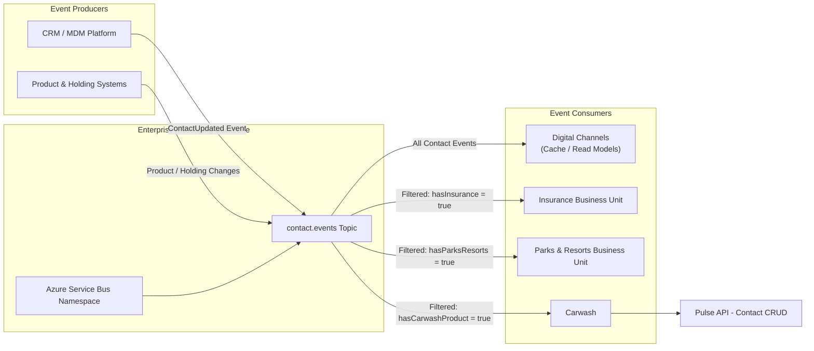

# Enterprise Contact Events Project Goal

This diagram is the canonical project goal. Azure Service Bus provides the
`contact.events` topic as the enterprise messaging backbone for contact, product, and
holding changes. Consumers receive either all contact events or subscription-filtered
events based on their business capability. Carwash uses matching events to integrate
with the Pulse Contact CRUD API.
