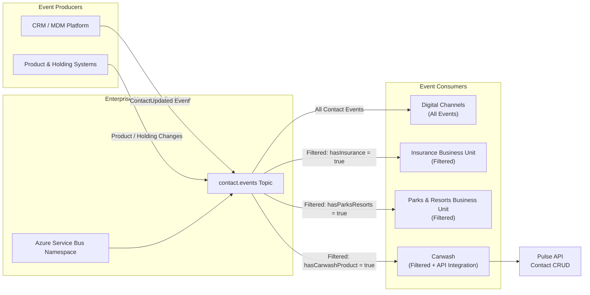

# Architecture - Project Goal

## System Diagram



Azure Service Bus provides the `contact.events` topic as the enterprise messaging backbone for contact, product, and holding changes. Consumers receive either all contact events or subscription-filtered events based on their business capability. Carwash uses matching events to integrate with the Pulse Contact CRUD API.

## Topology

### Topic: `contact.events`

The central routing point for all contact-related events in the enterprise.

### Subscriptions and Filtering

| Subscription | Filter Expression | Consumer | Purpose |
|--------------|-------------------|----------|---------|
| `all-events` | *(none)* | Digital Channels | Receives all contact updates (no filtering) |
| `insurance` | `attributes.hasInsurance = 'true'` | Insurance | Receives only contacts with insurance products |
| `parks-resorts` | `attributes.hasParksResorts = 'true'` | Parks & Resorts | Receives only contacts with parks & resorts holdings |
| `carwash` | `attributes.hasCarwashProduct = 'true'` | Carwash | Receives only contacts with carwash products; integrates with Pulse API |

## Event Types

### ContactUpdated (v1)

**Purpose:** Notify of contact creation or modification in CRM/MDM.

**Payload Structure:**
```json
{
  "id": "<uuid>",
  "type": "contact.updated",
  "source": "crm",
  "timestamp": "2024-09-15T10:30:00Z",
  "dataVersion": "1",
  "correlationId": "<trace-id>",
  "data": {
    "contact": {
      "contactId": "CUST-001",
      "firstName": "Jane",
      "lastName": "Doe",
      "email": "jane.doe@example.com",
      "phone": "+1-555-0123",
      "attributes": {
        "hasInsurance": true,
        "hasParksResorts": false,
        "hasCarwashProduct": true
      }
    }
  }
}
```

**Required Fields:** contactId, firstName, lastName  
**Optional Fields:** email, phone, attributes

### ProductHoldingChange (v1)

**Purpose:** Notify of product or holding lifecycle changes (create, modify, remove).

**Payload Structure:**
```json
{
  "id": "<uuid>",
  "type": "product.holding.changed",
  "source": "product-service",
  "timestamp": "2024-09-15T10:31:00Z",
  "dataVersion": "1",
  "data": {
    "contactId": "CUST-001",
    "holdingId": "HOLD-ABC-123",
    "productType": "carwash",
    "action": "created",
    "holdingData": { /* product-specific fields */ }
  }
}
```

**Required Fields:** contactId, holdingId, productType, action  
**Product Types:** insurance, parks-resorts, carwash, other  
**Actions:** created, modified, removed

## Consumer Behavior

### Digital Channels
- **Subscription:** `all-events` (no filter)
- **Processing:** Receives all contact events in real-time
- **Action:** Updates internal read models / cache for downstream systems

### Insurance
- **Subscription:** `insurance` (filtered by `hasInsurance = true`)
- **Processing:** Receives only contacts with active insurance products
- **Action:** Syncs to insurance management subsystem

### Parks & Resorts
- **Subscription:** `parks-resorts` (filtered by `hasParksResorts = true`)
- **Processing:** Receives only contacts with active parks & resorts holdings
- **Action:** Syncs to PMS (Property Management System)

### Carwash
- **Subscription:** `carwash` (filtered by `hasCarwashProduct = true`)
- **Processing:** Receives only contacts with active carwash products
- **Action:** Integrates with Pulse Contact CRUD API via HTTP (mock mode for local testing)

### Verifier
- **Role:** Scenario validation
- **Purpose:** Verifies that subscription filters route events correctly
- **Action:** Publishes test events and validates routing to each subscription

## Configuration

All applications are configured exclusively via **environment variables** (see [ADR-006](../decisions/ADR-006-environment-configuration.md)).

### Service Bus Settings

```powershell
ServiceBus__ConnectionString    # "Endpoint=sb://..." or emulator connection
ServiceBus__Namespace           # Namespace name (e.g., "my-namespace")
ServiceBus__TopicName           # Topic name (e.g., "contact.events")
ServiceBus__SubscriptionName    # Subscription name (varies by app)
```

### Carwash Settings (Carwash app only)

```powershell
Carwash__ApiUrl                 # Pulse API base URL
Carwash__MockMode               # true = mock HTTP responses; false = live API
Carwash__AuthToken              # Authentication token for Pulse API
```

## Key Design Decisions

1. **Separate Console Applications** — Each producer and consumer role runs independently, enabling horizontal scaling and independent deployment.
2. **Subscription-Based Filtering** — Azure Service Bus SQL-like filters reduce message volume to consumers (publisher-side filtering).
3. **JSON Schema + Data Annotations** — Event contracts defined as JSON Schema (schema-as-contract) with C# validation attributes for runtime enforcement.
4. **Async/Await Throughout** — All I/O operations (Service Bus, HTTP) use async APIs with `Task`-based patterns (see [ADR-004](../decisions/ADR-004-async-programming-model.md)).
5. **Dependency Injection** — Microsoft.Extensions.DependencyInjection for loose coupling, testability, and consistent service lifetimes.
6. **Environment-Only Configuration** — No secrets or hardcoded values in source code; full externalization via environment variables.
7. **Service Bus Emulator for Local Development** — Deterministic, offline testing without cloud credentials or subscription costs.

## Testing Approach

| Layer | Tools | Scope |
|-------|-------|-------|
| **Unit** | xUnit + Moq | DTO validation, serialization round-tripping, configuration loading |
| **Integration** | xUnit | Service Bus emulator, subscription filtering, message routing |
| **Scenario** | Verifier app | End-to-end event publishing and consumption verification |

Target minimum coverage: **≥80%** (see [ADR-007](../decisions/ADR-007-testing-strategy.md))

## Phases and Progression

- **Phase 1** (complete): Project structure, event contracts (JSON Schema), C# DTOs, application scaffolds
- **Phase 2**: Producer/consumer implementation, Service Bus emulator setup
- **Phase 3**: Unit and integration tests
- **Phase 4**: Bicep Infrastructure as Code, Azure deployment
- **Phase 5**: Performance validation, operational hardening

## References

- [PROJECT_BRIEF.md](../../PROJECT_BRIEF.md) — Business context and requirements
- [ADR-001: Decision Framework](../decisions/ADR-001-decision-framework.md)
- [ADR-004: Async Programming Model](../decisions/ADR-004-async-programming-model.md)
- [ADR-006: Environment Configuration](../decisions/ADR-006-environment-configuration.md)
- [ADR-007: Testing Strategy](../decisions/ADR-007-testing-strategy.md)
